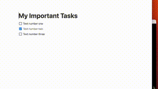

# Notion CLI Go

 



Notion CLI Go is a command-line interface tool written in Go to manage tasks in Notion.so. This tool is a new iteration based on the original [Python project](https://github.com/kris-hansen/notion-cli), now built in Go for improved performance and portability. This project is a work in progress, some of the features mentioned below are aspirational and not yet implemented.

## Installation

To install the project, you'll need to clone the repository and build the Go application. Here are the basic instructions:

```bash
git clone https://github.com/kris-hansen/notion-cli-go
cd notion-cli-go
go build
go install .
```

## Configuration

Before running the notioncli tool, you need to set the following environment variables (see the .env.example file):

- `NOTION_API_KEY`: Your Notion Official API key.
- `NOTION_PAGE_ID`: The URL for the page (ex: https://notion.so/my-page/{pageID}). Here are some [tips](https://developers.notion.com/docs/working-with-page-content#:~:text=Open%20the%20page%20in%20Notion,ends%20in%20a%20page%20ID.) for finding your page ID. You will also need to share this page as an integration to expose it to the cli tool.
- `LOCAL_TIMEZONE`: Your local timezone (ex: 'America/New_York').

For the `NOTION_API_KEY`, visit [Notion's integration page](https://www.notion.so/my-integrations) and create a new integration. Remember to share your task page with the integration.

## Usage

You can interact with the tool using the built binary:

```bash
./notioncli [command]
```

Here are the available commands:

- `list`: List all tasks on the Notion page.
- `add`: Add a new task to the Notion page.
- `check`: Mark a task as complete.
- `uncheck`: Mark a task as incomplete.
- `delete`: Delete a task from the Notion page.
- `completion`: Generate the autocompletion script for your shell
- `help`: Show help information.

## Known Limitations

Currently, the tool only supports a single Notion page at a time and is focused on the ToDo use case.

## Testing

Currently some of the utility package block functions have test coverage. Invoke the tests with:

```bash
go test -v ./...
```

## License

This project is licensed under the Apache License 2.0. See the LICENSE file for details.

